# RFC: Request for Comments — Projeto de Portfólio

## Título do Projeto:
Orienta Saúde  

## Linha de Projeto (Direction):
Plataforma Web 

## Autor:
Daniel Douglas dos Santos  

## Data da Proposta:
27/02/2026 

## Versão:
1.4

---

## 1. Visão do Produto e Impacto (O Problema)

### 1.1 Contexto e Problema

O acesso inicial a orientação em saúde ainda é um desafio para grande parte da população. Muitas pessoas enfrentam dúvidas ao apresentar sintomas, sem saber se devem procurar atendimento imediato ou aguardar evolução do quadro. 

Esse problema afeta principalmente:

- Pessoas sem conhecimento médico;
- Indivíduos com acesso limitado a serviços de saúde;
- Usuários que recorrem à internet para autodiagnóstico.

Esse problema ocorre:

- Quando surgem sintomas inesperados;
- Na dúvida entre ir ao médico ou não;
- Durante buscas na internet por autodiagnóstico,

Atualmente, esse problema é resolvido de três formas principais:

- Busca em sites e blogs;
- Uso de aplicativos de saúde;
- Atendimento direto em unidades médicas.

Limitações das soluções atuais:

- Informações genéricas ou não confiáveis;
- Risco de interpretação errada pelo usuário;
- Sobrecarga em serviços de saúde por casos não urgentes.

---

## 1.2 Origem da Demanda e Evidências

### Demanda Externa

A motivação inicial do projeto veio de relatos observados por uma profissional da área da saúde (estagiária em ambiente hospitalar), que identificou que muitos pacientes chegam às unidades de atendimento com dúvidas sobre sintomas que poderiam ser inicialmente classificados como leves ou moderados, gerando sobrecarga no atendimento e insegurança por parte dos próprios pacientes. 

A partir dessa observação, identificou-se a necessidade de uma ferramenta que auxiliasse usuários na compreensão inicial de sintomas, oferecendo orientação básica e indicação de nível de urgência, sem substituir avaliação médica profissional. 

### Pesquisa com usuários

Para validar essa necessidade, foi realizada uma pesquisa por meio de formulário online, com o objetivo de analisar o comportamento das pessoas ao lidar com sintomas de saúde. 

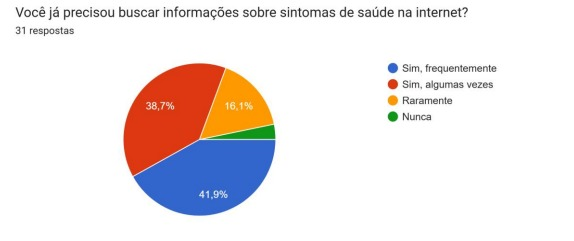

Observa-se que a maioria dos participantes já buscou informações sobre sintomas na internet, indicando um comportamento comum entre os usuários. 

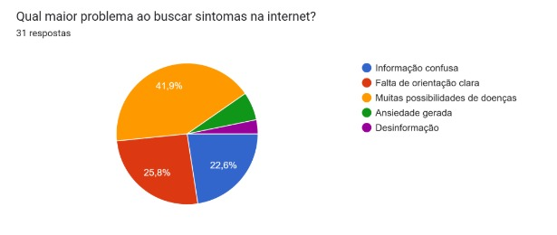

Observa-se que o maior problema ao buscar sintomas na internet são a quantidade de possibilidades de doenças, causando um sentimento de confusão nas pessoas. 

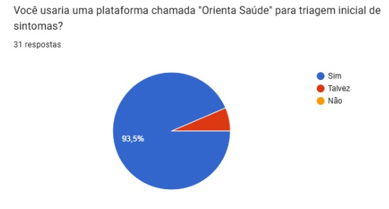

Mais de 90% dos participantes demonstraram interesse em uma plataforma para triagem inicial de sintomas. 

### Evidência de Interesse

Os resultados do questionário indicam um interesse real na proposta do sistema, especialmente no que se refere à necessidade de orientação inicial sobre sintomas de saúde. 

Além disso, observa-se que o comportamento de busca por informações médicas na internet é comum, porém frequentemente associado à insegurança e dificuldade de interpretação, reforçando a relevância da solução proposta. 

---

## 1.3 Análise de Soluções Existentes (Benchmark)

### Ada Health

Link: https://ada.com/pt  
Público Alvo: Usuários gerais.  
Funcionalidades Principais: Avaliação de sintomas com IA e pesquisas científicas.  
Limitações: Respostas longas e complexas.

### WebMD

Link: https://www.webmd.com  
Público Alvo: Estudantes da área de medicina e usuários gerais.  
Funcionalidades Principais: Conteúdo médico e verificação de sintomas.  
Limitações: Foco em informação, não em triagem prática. 

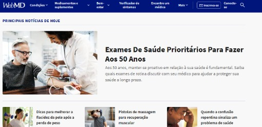 

### Symptomate

Link: https://symptomate.com/pt-br  
Público Alvo: Usuários de internet.  
Funcionalidades Principais: Avaliação de sintomas com IA.  
Limitações: Pode gerar múltiplas possibilidades sem indicar a urgência.

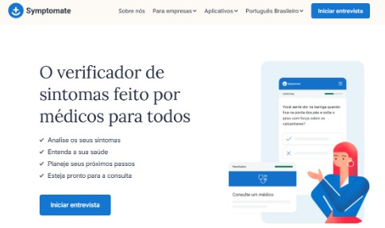

---

### Comparação

| Solução      | Pontos Fortes                                      | Limitações                                                                                          |
|-------------|----------------------------------------------------|------------------------------------------------------------------------------------------------------|
| Ada Health  | Possui ampla base de conhecimento médico           | Interface mais complexa e pode gerar respostas longas e pouco objetivas para usuários leigos        |
| WebMD       | Grande base de conteúdo médico e alta confiabilidade de informações | Foco em conteúdo informativo, sem classificação clara de urgência ou direcionamento prático imediato |
| Symptomate  | Interface simples e questionário guiado para avaliação de sintomas | Pode apresentar múltiplos resultados sem priorização clara do nível de urgência                     |

---

### Diferencial do Projeto:

Apesar da existência de diversas plataformas de verificação de sintomas, a maioria delas possui foco em fornecer informações médicas detalhadas ou possíveis condições associadas, o que pode gerar confusão em usuários sem conhecimento técnico. 

O projeto Orienta Saúde propõe uma abordagem mais direta e objetiva, focada exclusivamente na classificação de urgência e orientação inicial, facilitando a tomada de decisão do usuário. 

---

## 1.4 Público-Alvo

O sistema é voltado para:

- População em geral;
- Pessoas sem conhecimento médico;
- Usuários que buscam orientação inicial.

Perfil:

- Maior de idade;
- Uso via celular ou computador 

Contexto de uso:

- Em casa 
- Antes de decidir ir ao hospital 
- Durante dúvidas sobre sintomas 

Nível de conhecimento técnico esperado:

Conhecimento básico em navegação web. 

---

## 1.5 Objetivos do Projeto

### Objetivo Geral:

Desenvolver uma plataforma web capaz de realizar triagem inicial de sintomas, classificando o nível de urgência e fornecendo orientações educativas ao usuário. 

### Objetivo Específicos:

- Implementar um sistema de análise de sintomas com apoio de IA generativa e arquitetura RAG; 
- Permitir entrada estruturada de sintomas;
- Desenvolver uma base de conhecimento médica para recuperação contextual de informações; 
- Desenvolver interface intuitiva e acessível.

---

## 1.6 Métricas de Sucesso (KPIs)

O sucesso do sistema será avaliado baseado nas seguintes métricas:

- Tempo de resposta inferior a 3 segundos;
- Precisão das respostas geradas pela IA;
- Cobertura de sintomas implementados: mínimo de 15 sintomas diferentes.
- Latência inferior a 250ms

# 2. Engenharia de Requisitos

## 2.1 Personas

### Persona 1 – Maria Eduarda

**Contexto:**  
Maria tem 21 anos e trabalha em escritório. Costuma pesquisar sintomas na internet quando sente algum desconforto.

#### Objetivos

- Entender se os sintomas são graves;
- Saber quando procurar atendimento médico;
- Receber orientações rápidas.

#### Principais dificuldades

- Encontrar informações confiáveis;
- Ansiedade ao pesquisar sintomas;
- Dificuldade com termos médicos.

---

### Persona 2 – Gustavo Mafra

**Contexto:**  
Gustavo tem 35 anos, é motorista de aplicativo e evita ir ao hospital sem necessidade.

#### Objetivos

- Identificar rapidamente o nível de urgência;
- Evitar deslocamentos desnecessários;
- Receber orientações práticas.

#### Principais dificuldades

- Falta de tempo;
- Dificuldade em decidir se o caso é urgente;
- Informações contraditórias na internet.

---

## 2.2 Casos de Uso Principais
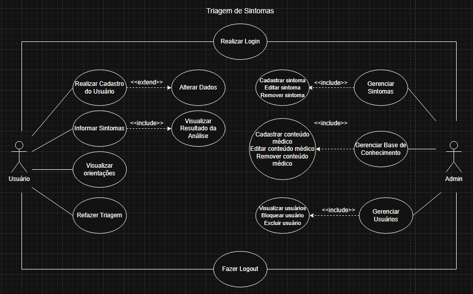

---

## 2.3 Requisitos Funcionais (RF)

- RF01 - O sistema deve permitir que o usuário informe sintomas por meio de descrição textual. 
- RF02 - O sistema deve permitir que o usuário informe sua idade para auxiliar na triagem. 
- RF03 - O sistema deve permitir que o usuário envie os dados preenchidos para análise. 
- RF04 - O sistema deve validar se as informações mínimas necessárias foram preenchidas antes da análise. 
- RF05 - O sistema deve utilizar recuperação contextual de conhecimento (RAG) para buscar informações médicas relacionadas aos sintomas informados. 
- RF06 - O sistema deve permitir que a IA generativa analise os sintomas informados juntamente com o contexto recuperado. 
- RF07 - O sistema deve apresentar possíveis condições relacionadas aos sintomas informados. 
- RF08 - O sistema deve apresentar um nível estimado de urgência classificado em leve, moderado, urgente ou emergência. 
- RF09 - O sistema deve apresentar orientações educativas com base na análise realizada. 
- RF10 - O sistema deve solicitar informações adicionais caso os dados fornecidos sejam insuficientes para uma análise confiável. 

---

## 2.4 Requisitos Não Funcionais (RNF)

- RNF01 - O sistema deve apresentar os resultados da análise em tempo adequado após o envio das informações pelo usuário.- 
- RNF02 - O sistema deve suportar múltiplos usuários simultaneamente sem perda significativa de desempenho.
- RNF03 - O sistema deve possuir interface simples, intuitiva e de fácil utilização. 
- RNF04 - O sistema deve ser responsivo e compatível com dispositivos móveis e desktops. 
- RNF05 - O sistema deve garantir alta disponibilidade da plataforma. 
- RNF06 - O sistema deve proteger os dados processados contra acessos indevidos. 
- RNF07 - O sistema deve utilizar Java com Spring Boot no desenvolvimento do backend. 
- RNF08 - O sistema deve utilizar React com Vite e TypeScript no desenvolvimento do frontend. 
- RNF09 - O sistema deve utilizar MySQL como sistema gerenciador de banco de dados. 
- RNF10 - O sistema deve utilizar integração com API de IA generativa para processamento das análises. 

---

## 2.5 Regras de Negócio

- RN01 - Apenas usuários autenticados poderão acessar histórico.
- RN02 - O sistema deverá apresentar um nível estimado de urgência classificado em leve, moderado, urgente ou emergência.
- RN03 - O sistema não fornecerá diagnósticos definitivos.
- RN04 - O sistema deverá apresentar apenas possíveis condições relacionadas aos sintomas informados.
- RN05 - Em casos classificados como emergência, o sistema deverá recomendar imediatamente a busca por atendimento médico presencial.
- RN06 - O usuário deverá informar sintomas e dados mínimos necessários para que a análise seja realizada. 
- RN07 - O sistema deverá solicitar mais informações caso a análise não possua confiança suficiente.
- RN08 - O sistema deverá validar os dados obrigatórios antes de processar a análise.

---

## 2.6 Fora do Escopo
- Realização de consultas médicas online. 
- Emissão de receitas médicas. 
- Diagnóstico médico definitivo. 
- Integração com hospitais, clínicas ou planos de saúde. 
- Atendimento emergencial em tempo real. 
- Monitoramento em tempo real de sinais vitais. 
- Integração com dispositivos médicos ou smartwatches.
- Agendamento de consultas médicas. 

---

# 3. Fluxos e Comportamento do Sistema

## 3.1 Fluxo Principal do Usuário
Diagrama de Atividades:

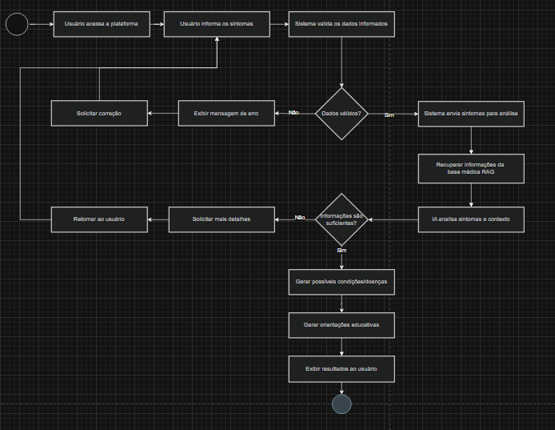

Diagrama de Sequência:

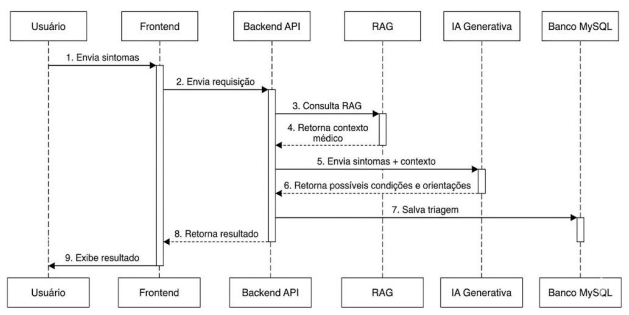

## Fluxos Alternativos

### Fluxo Alternativo 1 – Usuário não informa sintomas

1. Usuário acessa a tela de triagem;
2. Sistema solicita sintomas;
3. Usuário tenta continuar sem preencher;
4. Sistema exibe mensagem de erro;
5. Usuário permanece na mesma tela.

---

### Fluxo Alternativo 2 – Informações insuficientes

1. Usuário informa poucos sintomas;
2. Sistema identifica insuficiência de dados;
3. Sistema solicita mais detalhes;
4. Usuário complementa informações.

---

### Fluxo Alternativo 3 – Cancelamento da triagem

1. Usuário inicia a triagem;
2. Usuário cancela processo;
3. Sistema interrompe análise;
4. Usuário retorna à tela inicial.

---

# 4. Mockups e Experiência do Usuário (UX)

## 4.1 Fluxo De Navegação
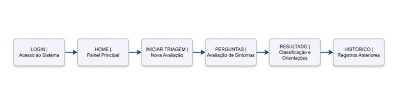

## 4.2 Mockups das Telas
Para o desenvolvimento dos mockups e protótipos da interface do sistema Orienta
Saúde, foi utilizada o Figma, permitindo a criação visual das telas e navegação.
Os protótipos desenvolvidos representam o fluxo principal do sistema, incluindo a
tela inicial, cadastro de usuário, triagem de sintomas e visualização dos resultados.

Protótipo navegável:
https://www.figma.com/design/MwANCyJFVVgYpLfWUfv4zg/TCC?node-id=0-1&t=Vnxvd5OEJAm97btt-1

### Tela Inicial:

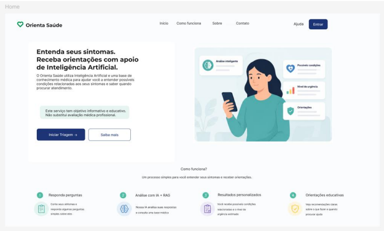

A tela inicial apresenta o sistema Orienta Saúde ao usuário, explicando de forma
simples o objetivo da plataforma e permitindo iniciar o processo de triagem de
sintomas. Nessa tela, o usuário pode acessar o sistema, realizar login ou cadastro e
iniciar uma nova triagem.

### Tela de entrada de dados:

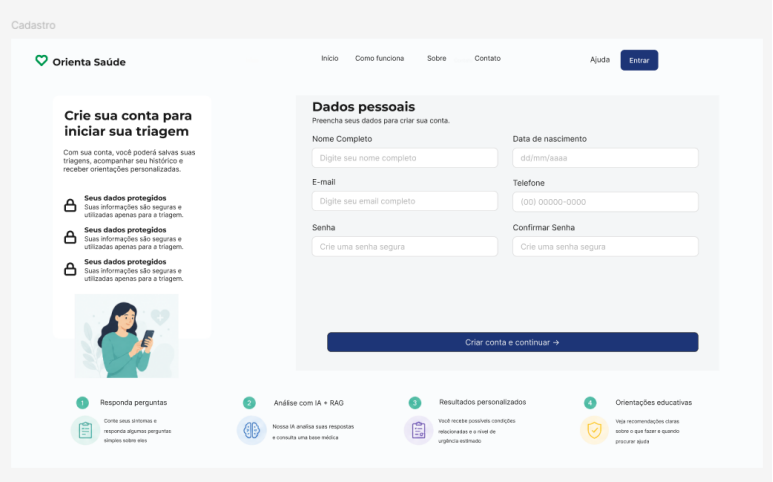

A tela de entrada de dados permite que o usuário realize seu cadastro na plataforma
Orienta Saúde, informando dados pessoais necessários para acesso ao sistema.
Nessa tela, o usuário pode preencher informações como nome, e-mail, telefone,
data de nascimento e senha para criar sua conta e iniciar a triagem de sintomas.

### Fluxo Principal:

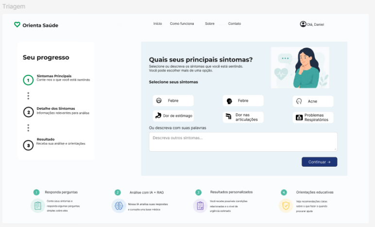

A tela de fluxo principal representa a principal funcionalidade do sistema Orienta
Saúde, permitindo que o usuário informe seus sintomas e acompanhe o progresso
da triagem. Nessa etapa, o usuário pode selecionar ou descrever sintomas,
responder perguntas complementares e avançar pelas etapas da análise até
receber o resultado da triagem com orientações educativas e nível estimado de urgência.

### Tela de Resultado:

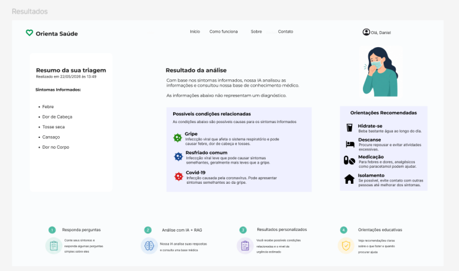

A tela de resultado apresenta ao usuário a análise realizada pelo sistema com base
nos sintomas informados durante a triagem. Nessa etapa, o usuário pode visualizar
possíveis condições relacionadas aos sintomas, o nível estimado de urgência e
orientações educativas sobre quando procurar atendimento médico ou quais
cuidados tomar.

## 4.3 Fluxo de Interação do Usuário
1- O usuário acessa a plataforma através da tela inicial

2- O usuário realiza login ou cria uma nova conta para acessar o sistema.

3- Após acessar o sistema, o usuário inicia uma nova triagem, informa os
sintomas e intensidade.

4- O usuário visualiza possíveis condições relacionadas, nível de urgência e
orientações educativas.

---
# 5. Arquitetura do Sistema

## 5.1 Diagrama C4
### Nível 1 - Diagrama de Contexto:

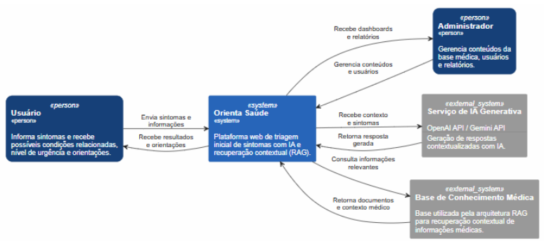

### Nível 2 - Diagrama de Containers:

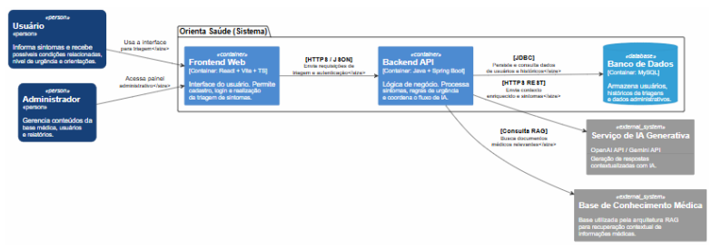

### Nível 3 - Diagrama de Componentes:

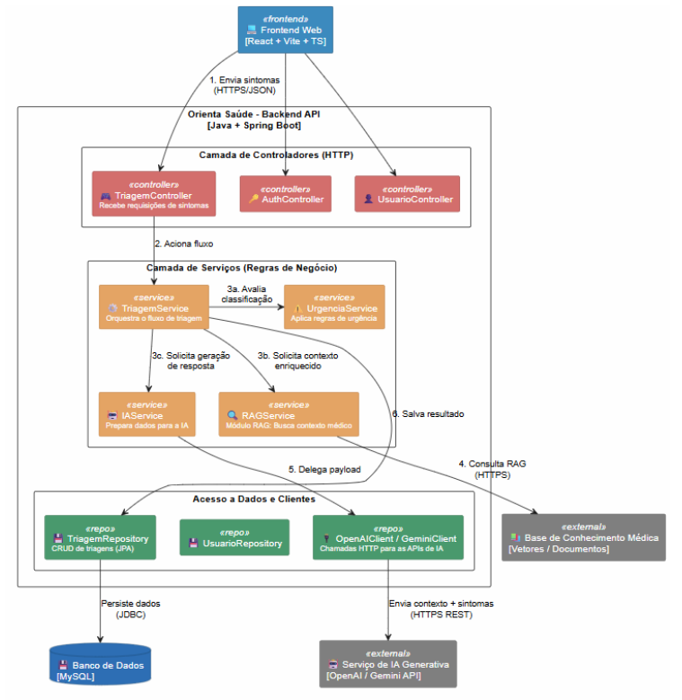

## 5.2 Modelo de Dados
### DER (diagrama entidade relacionamento):

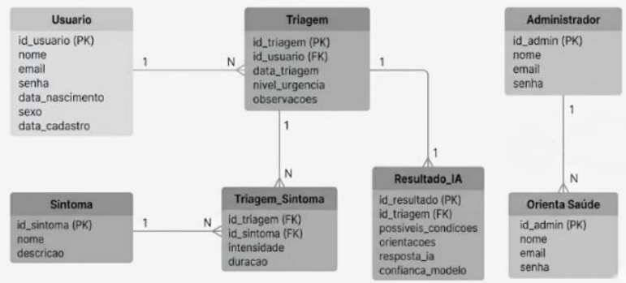

### Esquema Relacional:

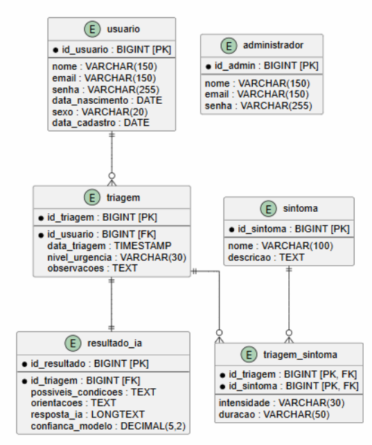

### Modelo de Documentos (NoSQL):

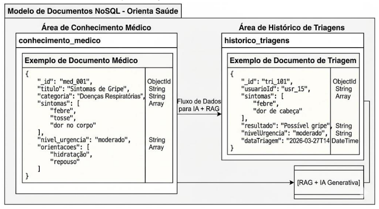

## 5.3 Principais Componentes

- Java Spring Boot
- React
- Vite
- TypeScript
- MySQL
- Gemini API
- Arquitetura RAG

---

## 5.4 Stack Tecnológica

## Java Spring Boot

Escolhido pela facilidade na criação de APIs REST, organização em camadas e integração com banco de dados e serviços externos.

## React

Escolhido pela criação de interfaces modernas, componentização e melhor experiência do usuário.

## TypeScript

Escolhido pela tipagem estática, reduzindo erros e melhorando a manutenção do código.

## MySQL

Escolhido pela confiabilidade, facilidade de modelagem relacional e integração com Spring Boot.

## Gemini API

Escolhida por ser gratuito e pela capacidade de interpretar linguagem natural e gerar respostas contextualizadas.

---

# 6. Segurança e Privacidade 

O Orienta Saúde adotará boas práticas de segurança para proteger os dados dos usuários. O sistema contará com autenticação e controle de acesso, garantindo que cada usuário visualize apenas suas próprias informações. 
 
Também serão aplicadas medidas para reduzir riscos relacionados ao OWASP Top 10, como validação das entradas, proteção contra ataques comuns e uso de consultas seguras ao banco de dados. As senhas serão armazenadas de forma criptografada e toda a comunicação ocorrerá por meio de HTTPS. 

## 6.1 Privacidade e LGPD 

O sistema coletará apenas os dados necessários para seu funcionamento, como nome, e-mail, senha e histórico de triagens. Essas informações serão armazenadas de forma segura e utilizadas exclusivamente para fornecer o serviço. 
 
Em conformidade com a LGPD, o usuário poderá solicitar a exclusão de sua conta e de seus dados pessoais, que serão removidos do sistema, salvo quando houver obrigação legal de retenção. 
 
---

# 7. Planejamento do Projeto

| Marco | Descrição | Prazo |
| :---: | :--- | :---: |
| **M1** | Finalização do documento RFC | Junho/2026 |
| **M2** | Início do desenvolvimento do projeto | Julho/2026 |
| **M3** | Desenvolvimento das funcionalidades essenciais, incluindo autenticação, cadastro de usuários e triagem de sintomas | Agosto/2026 |
| **M4** | Implementação da integração com IA e RAG, além do histórico de triagens e melhorias na interface | Setembro/2026 |
| **M5** | Integração de todos os módulos, otimizações e refinamento da experiência do usuário | Outubro/2026 |
| **M6** | Realização de testes funcionais, correção de falhas e validação do funcionamento da plataforma | Novembro/2026 |
| **M7** | Entrega da versão final do sistema do Trabalho de Conclusão de Curso | Dezembro/2026 |

---

# 8. Referências

GITHUB. _GitHub._ Disponível em: https://github.com. Acesso em: 27 fev. 2026. 

ADA HEALTH. _Ada Health._ Disponível em: https://ada.com/pt/. Acesso em: 23 mar. 2026. 
 
SYMPTOMATE. _Symptomate: AI Symptom Checker._ Disponível em: https://symptomate.com/. Acesso em: 23 mar 2026. 
 
GOOGLE. _Gemini API Documentation._ Disponível em: https://ai.google.dev/gemini-api/docs. Acesso em: 18 mai. 2026. 
 
SPRING. _Spring Boot Documentation._ Disponível em: https://spring.io/projects/spring-boot. Acesso em: 18 mai. 2026. 
 
REACT. _React Documentation._ Disponível em: https://react.dev. Acesso em: 18 mai. 2026. 
 
ORACLE. _MySQL 8.0 Reference Manual._ Disponível em: https://dev.mysql.com/doc/. Acesso em: 18 mai. 2026. 
 
BRASIL. _Lei nº 13.709, de 14 de agosto de 2018. Lei Geral de Proteção de Dados Pessoais (LGPD)._ Disponível em: https://www.planalto.gov.br/ccivil_03/_ato2015-2018/2018/lei/l13709.htm. Acesso em: 11 jun. 2026.

---

# 9. Apêndices

## 9.1 Mockups

A tela de Histórico de Triagens permite que o usuário visualize todas as triagens realizadas anteriormente de forma organizada e cronológica. Nela são exibidos a data e horário da consulta, os principais sintomas informados, o nível de urgência identificado e um botão para acessar os detalhes completos de cada análise, junto com filtros para facilitar a busca. 

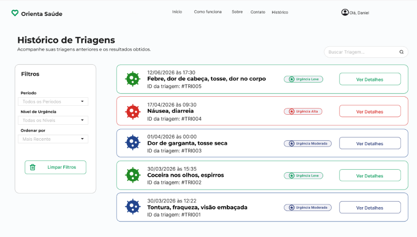

## 9.2 Repositório do Projeto

Repositório contendo todas as informações do projeto:

Github: https://github.com/danisantosss/Orienta-Saude 

## 9.3 Protótipo Navegável

Protótipo contendo todas as telas do projeto:

Figma: https://www.figma.com/design/MwANCyJFVVgYpLfWUfv4zg/TCC?node-id=0-1&t=AtYAu8utmddZUWFQ-1

# 10. Parecer do Comitê de Avaliação 

Em Andamento...
